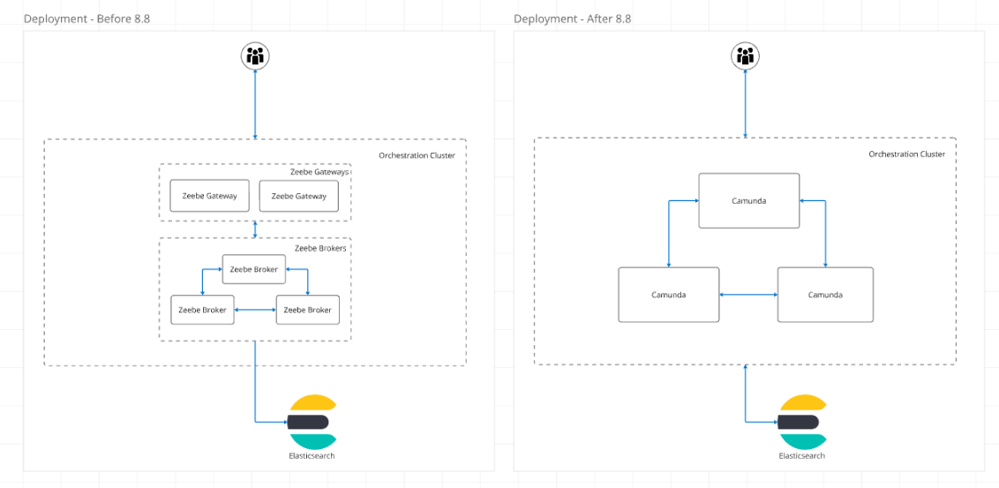

# Reliability testing

We define reliability testing as a type of software testing and practice that validates system performance and reliability. It can thus be done over time and with injection failure scenarios (injecting chaos).

The aim of such testing practices is to ensure that [2]

* Issues are identified before customers see them (proactively finding bugs)
* The system can run fault-free / reliably over a longer / specific period of time for its intended purpose and specific environment
    * to ensure that the system will be able to meet the needs of its users over the long term
* Failures are handled gracefully, validating reliability even after error cases
* Performance stays within its bounds, even over long periods of time.

The last points are especially interesting, as they allow for identifying issues that are with normal unit or integration tests not discoverable. For example, memory leaks or problems in distribution systems, etc.

Reliability testing consists of several sub-testing practices (depending on the context/area, company, this might vary).

While several resources ([1], [2]) cover feature or regression testing as one part of reliability testing, we see this as part of our automated acceptance testing done by Engineers and/or QA. See also related documentation about this here.

We focus as part of the reliability testing on topics like load testing (stress and endurance testing), and recovery testing (done by chaos experiments)

[1]: https://www.gremlin.com/blog/reliability-testing-definition-history-methods-and-examples
[2]: https://testsigma.com/guides/reliability-testing/
[3]: https://www.geeksforgeeks.org/software-testing-reliability-testing/

## Load testing

Load testing, or previously called "benchmarks" is a practice that was introduced [in early 2019](https://github.com/zeebe-io/zeebe-benchmark). As of today, we run load tests on a regular basis.

### General Goals

With our load test, we pursue the following goals

* Build up confidence in the system's reliability
* Discover failures when running over longer periods of time
    * Memory leaks
    * Performance degradation
    * Business logic errors
    * Distributed system failures
* Discover configuration/set up issues in different environments, SM/SaaS

### Setup

The setup for all of our load tests is equal for better comparability. We use a custom helm chart ([zeebe-benchmark](https://github.com/camunda/zeebe-benchmark-helm)) based on our official [Camunda Platform Helm chart](https://github.com/camunda/camunda-platform-helm).

We always ran load tests with a three-node cluster, configured with three partitions and a replication factor of three. Depending on the version of Camunda/Zeebe (pre 8.8), we might only deploy Zeebe Brokers and the Zeebe (standalone) gateway (with two replicas) or the single Camunda application (with an embedded gateway). To validate that our data flow pipeline is working, we are running an Elasticsearch cluster with three nodes for any Camunda test cluster.

On top of the [Camunda Platform Helm Chart](https://github.com/camunda/camunda-platform-helm), the benchmark Helm Chart deploys different applications. They can be distinguished into workers and starters. The related code can be found in the [Camunda mono repository](https://github.com/camunda/camunda/tree/main/zeebe/benchmarks/project).

Depending on the test variant, different process models are created and executed by the Starter and Worker applications. They only differ in configurations, which can be done by the respective [zeebe-benchmark](https://github.com/camunda/zeebe-benchmark-helm) Helm chart, and their [values files](https://github.com/camunda/zeebe-benchmark-helm/blob/main/charts/zeebe-benchmark/values.yaml).

All of this is deployed in a Zeebe-maintained (as of now; 16 Jun 2025) Google Kubernetes Engine (GKE) cluster (zeebe-cluster), in its own zeebe-io Google Cloud Project (GCP). Details of the general infrastructure, which is deployed related to observability (Prometheus), can be found in the [Zeebe infrastructure repository](https://github.com/camunda/zeebe-infra).

### Variants

We run our load tests in different variants to cover different goals.

#### Normal (artificial) load
A load test where we run some artificial load, ensuring that the system behaves reliably.

It contains only a start event, one service task, and end end event. Covering a straight-through processing use case, with a [bigger data set of ~45 kb](https://github.com/camunda/camunda/blob/main/zeebe/benchmarks/project/src/main/resources/bpmn/big_payload.json).

Reducing the used feature set to a small amount allows easy comparison between tests, as fewer variations and outside factors can influence test results. This test load is historical, as it was one of the first we designed. Likely might be replaced by the more realistic load tests.

The idea here is not to overload or stress the system, but to run a more stable and continuous load, to validate the reliability of the system.

**The expected load is:**

* 150 process instances per second (PI/s) completed.
* 150 task instances per second (TI/s) completed

_Intrinsic SLO to always be able to satisfy such a load, and perform reliably._

#### Latency load

Similar to the normal load test, we ran the artificial (normal) process model to run some latency-related tests. To validate the latency, we reduce the load to one PI/s, to reduce the blast radius, and make sure we have clear values for the latency of process instance completion.

*As of now, there is no clear SLO/SLA defined for such.*
